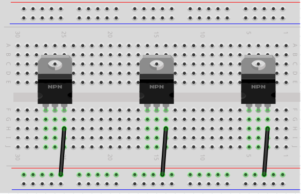
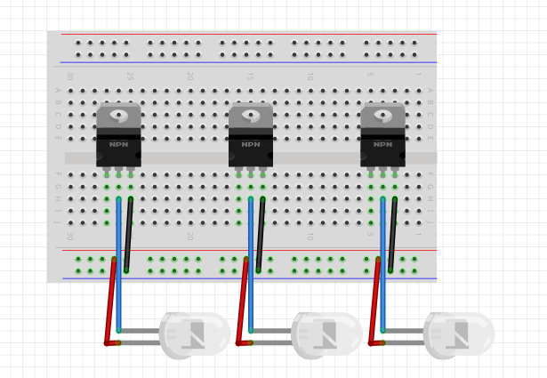
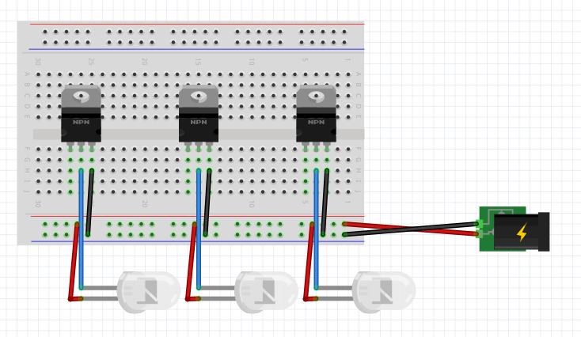
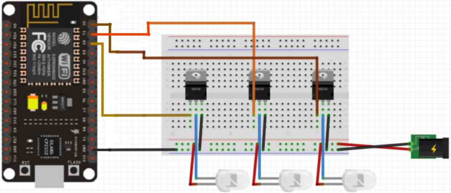

# Blink_App
LED strip controlled by Android app. 

## Hardware requirements
- Android 5.0 (or higher) device 
- Lolin NodeMCU V3 ESP8266
- 3x TIP122 transistor
- 3x LED strip (one color)
- Jumper cables

## Wiring

##### Transistors

##### LED strips

##### Power supply

##### NodeMCU

