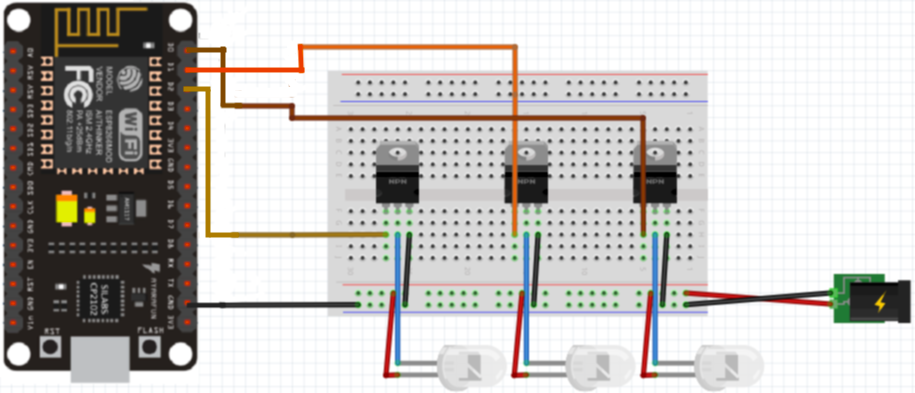

# Blink_App
LED pásiky kontrolované android aplikáciou.

## Android aplikácia
Android apka obsahuje štyri prepínacie tlačítka, ktoré sa používajú pre zapínanie a vypínanie LED pásikov. Jeden prepínač je pre všetky tri pásik a potom pre každý pásik samostatný prepínač.

Aplikácia sa v prednastavenom stave pripája na wifi IP a portom: **192.168.1.101:5005**

After start app checks actual status by sending an UDP packet with status request and gets the answer. On base of status, toggle buttons are set. If connection was successful, waits for user interaction.
Po spustení aplikácia skontroluje aktuálny stav odoslaním paketu UDP so žiadosťou o status a dostane odpoveď. Na základe stavu sa nastavujú prepínacie tlačidlá. Ak bolo pripojenie úspešné, čaká sa na interakciu používateľa.

##### UDP komunikácia
Na odosielanie paketov UDP sa používa knižnica Anko a vytvorí sa DatagramSocket. Toto sa robí na pozadí Coroutine.

## NodeMCU aplikácia
Aplikácia bežiaca na Lolin NodeMCU je zodpovedná za riadenie LED pásikov. Komunikuje s aplikáciou pre Android a dostáva príkazy na zapínanie a vypínanie pásikov. Apka je schopná komunikovať so 16 zariadeniami Android súčasne, preto sa vytvára zoznam kontaktov. Do tohto zoznamu sa automaticky pridá každá Android apka, ktorá sa prihlási do rovnakej wifi siete.
Aplikácia sa v prednastavenom stave pripája na wifi IP a portom: **192.168.1.104:5005**

## Hardvérové požiadavky
- Android 5.0 (alebo novšie) zariadenie
- Lolin NodeMCU V3 ESP8266
- 3x TIP122 tranzistor
- 3x LED pásik (jednofarebný)
- Vodiče

## Prepojenie káblov

##### Tranzistory

##### LED pásiky

##### Napájanie

##### NodeMCU
